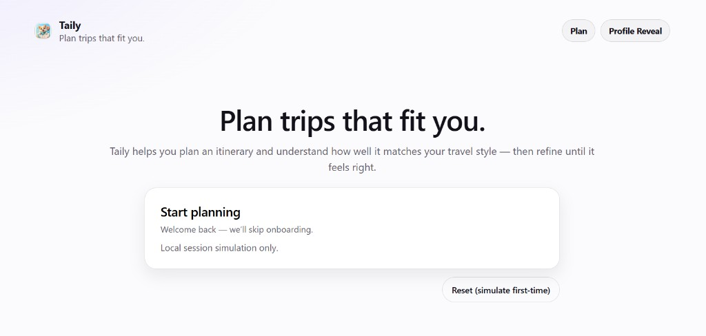
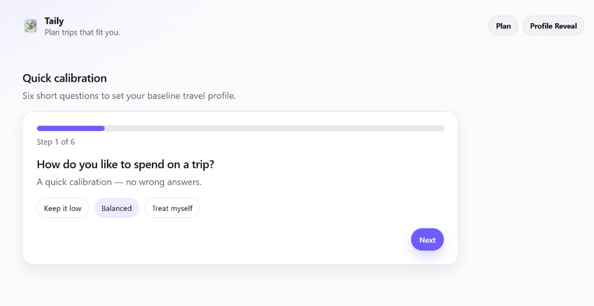
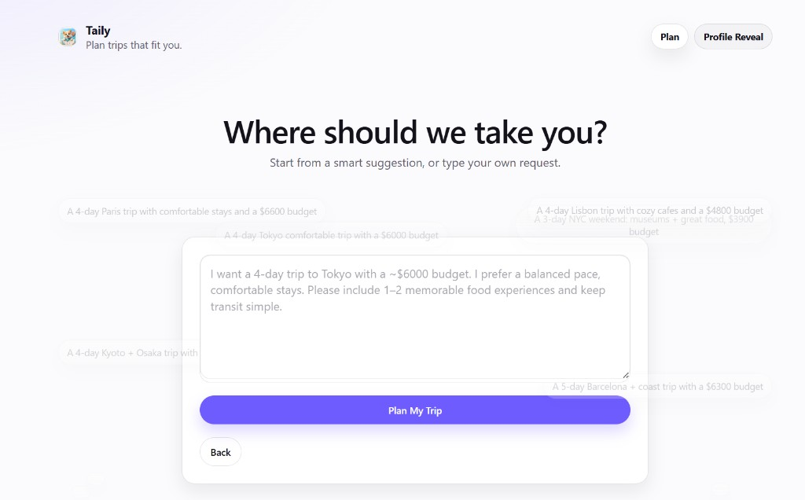
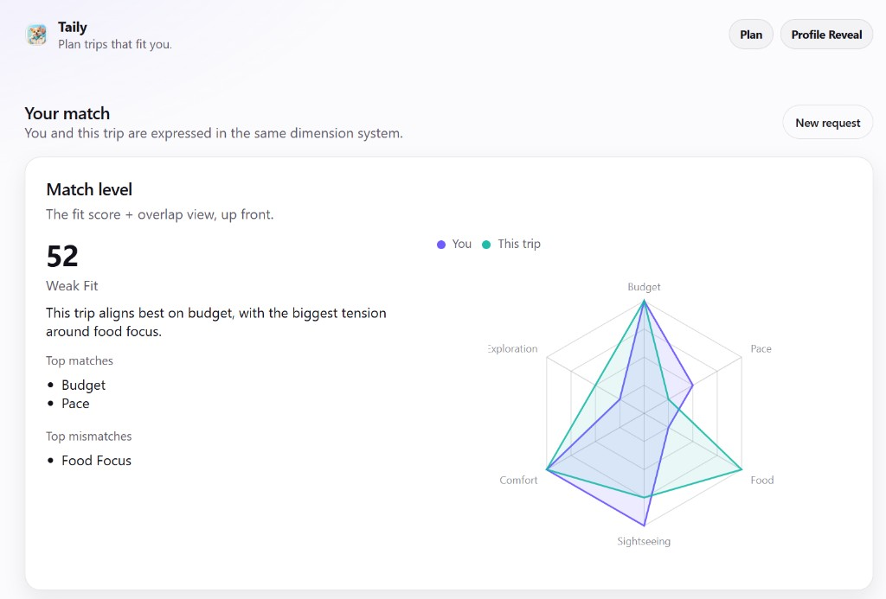
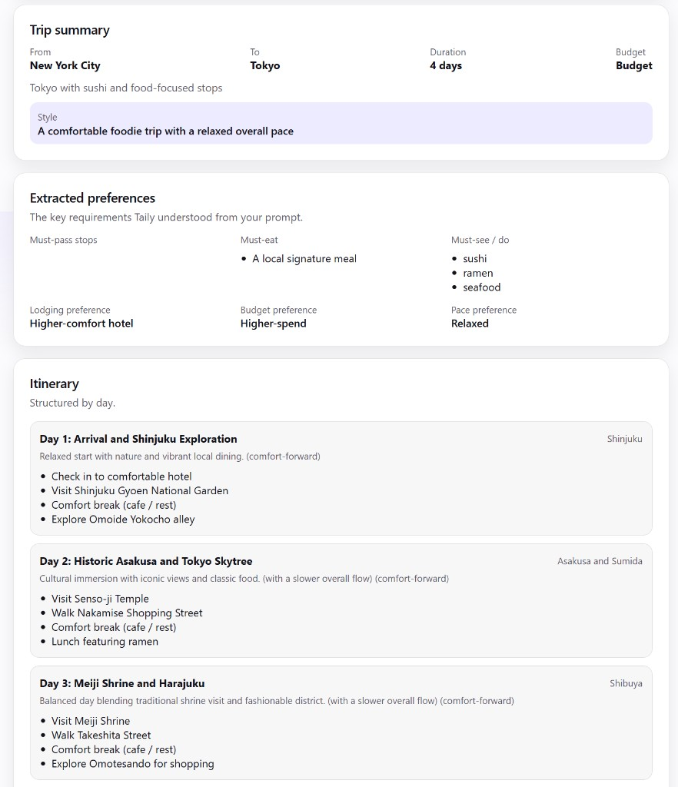
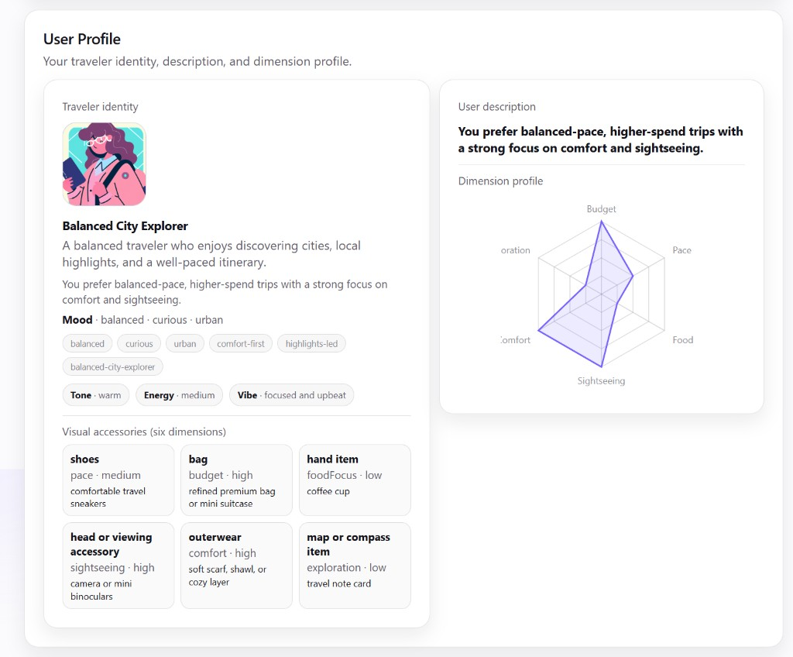
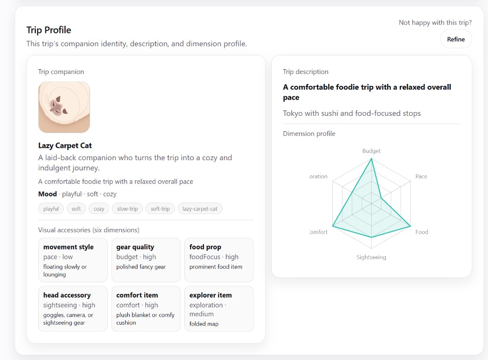
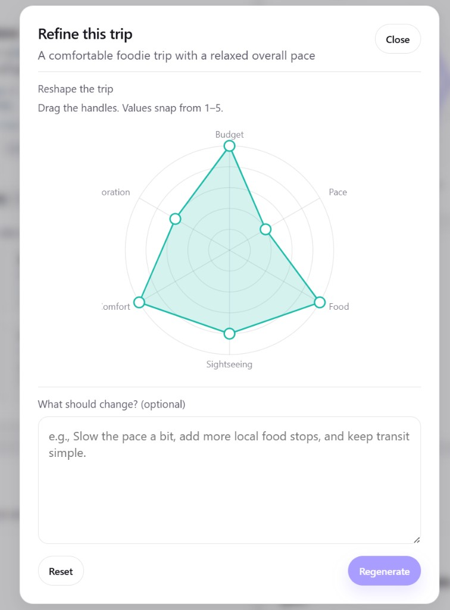

# Taily

**Plan trips that fit you.**

Taily is a travel planning MVP that pairs **itinerary generation** with an explicit **fit layer**: it builds a lightweight traveler profile, generates a trip, and shows (and explains) how well that trip matches the traveler—so you can refine toward a better fit instead of restarting from scratch.

**Live Demo**: `https://taily-three.vercel.app`  
**Demo Video**: `https://www.youtube.com/watch?v=6lqpFsmA-7E`

---

## Screenshots

### Welcome → onboarding





### Trip input → match + result







### Profiles + refinement







---

## What Taily is

Taily is an AI-first “travel companion” experience built around a simple loop:

**baseline traveler profile → trip request → generated itinerary → trip-fit analysis → refine → updated result**

Unlike basic itinerary generators, Taily treats “the plan” and “the fit” as separate, comparable objects.

---

## The product problem it solves

Most trip generators can produce something plausible, but they don’t help answer the question that drives real confidence:

**Does this trip actually fit me?**

Taily’s core idea is that a trip can be *reasonable* and still feel wrong—too rushed, too expensive, too sightseeing-heavy, not food-forward enough, etc. Taily makes that mismatch visible and actionable.

---

## Core features (V1 / MVP)

- **Welcome + routing**
  - First-time users go to onboarding
  - Returning users skip to trip input (simulated via local session state)
- **Lightweight onboarding**
  - Six fast questions → baseline **traveler profile** across six dimensions
- **Single natural-language trip input**
  - One main prompt box (AI-first, no form-like destination/budget fields)
- **Generate-with-fit result**
  - Day-by-day itinerary
  - Extracted preferences / requirements
  - Fit score + label, top matches/mismatches, and a short explanation
- **Refine**
  - Adjust trip dimensions and/or add a refinement prompt
  - Re-generates the result within the same experience
- **Identity system (supportive layer)**
  - Traveler archetype + trip companion archetype
  - Portrait generation support (kept lightweight; no avatar builder)

---

## Key product concepts

- **Dual-profile matching**
  - Taily represents both the traveler and the trip in the same six-dimension system.
- **Traveler profile**
  - Baseline “how you like to travel” (created during onboarding).
- **Trip profile**
  - “What this specific trip feels like” in the same dimensions.
- **Reveal flow**
  - After generation, the app reveals the trip’s profile/identity before the full result comparison.
- **Refine**
  - Directional iteration: change dimensions and/or add text → updated itinerary + updated fit.
- **Identity system**
  - Adds personality and memorability without overwhelming the core utility.

---

## Tech stack

**Frontend**
- React (Vite) + TypeScript
- React Router
- CSS (tokens + global styles)

**Backend**
- Spring Boot (Java 21, Maven)
- REST API
- OpenAI integration (configurable; can be disabled via env)

---

## Local development setup

### Prerequisites
- Node.js (recommended: latest LTS)
- Java 21
- Maven (or use your IDE’s Maven integration)

### 1) Start the backend

From `taily-backend/`:

```bash
mvn spring-boot:run
```

Backend defaults to `http://localhost:8080` (see `taily-backend/src/main/resources/application.yml`).

If you want OpenAI-backed behavior locally, copy the example env file:

```bash
cp taily-backend/.env.example taily-backend/.env
```

Quick check:

```bash
curl http://localhost:8080/health
```

### 2) Start the frontend

From `taily-frontend/`:

```bash
npm install
npm run dev
```

Frontend will connect to the backend at `http://localhost:8080` by default (or `VITE_API_BASE_URL` if set).

---

## Environment variables (copy/paste templates)

Taily supports local `.env` files for convenience. **Do not commit real secrets.**

### Frontend (`taily-frontend/.env.local`)

```env
# Optional. Defaults to http://localhost:8080
VITE_API_BASE_URL=http://localhost:8080
```

### Backend (`taily-backend/.env`)

```env
# Enable/disable AI-backed behavior (falls back to disabled-mode if false)
OPENAI_ENABLED=true

# Required when OPENAI_ENABLED=true
OPENAI_API_KEY=YOUR_OPENAI_KEY_HERE

# Optional model knobs
OPENAI_MODEL=gpt-4.1-mini
OPENAI_IMAGE_MODEL=dall-e-2
OPENAI_PORTRAIT_SIZE=512x512
```

Note: The backend intentionally loads `taily-backend/.env` (or a working-directory `.env`) at startup (see `DotenvEnvironmentPostProcessor`).

---

## Project structure (high-level)

```text
Taily/
  docs/                 Product + UX docs (specs, scope, contracts)
  taily-frontend/       React/Vite web app
    public/             Static assets (favicon/app icon/manifest)
    src/
      components/       UI building blocks (cards, charts, layout, etc.)
      pages/            Route-level pages (welcome, onboarding, trip input, result)
      lib/              API client + session utilities
      data/             Mock data and onboarding question set
      styles/           Global styles + design tokens
      types/            Frontend data contracts (TypeScript)
  taily-backend/        Spring Boot API (Java)
    src/main/java/      Controllers, services, DTOs, integrations
    src/main/resources/ App configuration
```

Key endpoints:
- `POST /profile/create`
- `POST /trip/generate-with-fit`
- `POST /trip/refine`
- `POST /identity/portrait`
- `GET /health`

---

## Current MVP status

- End-to-end flow is working:
  - Welcome → Onboarding → Trip input → Generate-with-fit → Result → Refine
- Local session state simulates “first-time vs returning user”
- UI is intentionally lightweight and product-focused (calm, card-based, fit-forward)

---

## Future improvements / roadmap

Product & UX
- Stronger “refine” UX (smarter defaults, clearer deltas, less friction)
- Better explanation quality (why a mismatch exists, and what to change)
- Sharper visual hierarchy for demo-quality storytelling (without dashboard density)

Engineering
- Add persistence + real auth (replace local-session simulation)
- Improved observability + error states for AI/network failures
- Test coverage and contract validation

---

## Deployment / demo notes

Taily is deployed as two separate services:

- **Frontend**: Vercel (Vite/React static build)
- **Backend**: Render (Spring Boot API)

**Live demo**: `https://taily-three.vercel.app`

### Deploy the backend to Render

Create a **Web Service** from the `taily-backend/` directory.

- **Build command**: `mvn -q -DskipTests package`
- **Start command**: `java -jar target/taily-backend-0.0.1-SNAPSHOT.jar`

Backend environment variables (Render → Environment):

```env
# Required for real AI calls
OPENAI_API_KEY=YOUR_OPENAI_API_KEY_HERE

# Recommended
OPENAI_ENABLED=true
OPENAI_MODEL=gpt-4.1-mini
OPENAI_IMAGE_MODEL=dall-e-2
OPENAI_PORTRAIT_SIZE=512x512

# Allow your Vercel frontend to call the API (comma-separated patterns)
# Example:
# CORS_ALLOWED_ORIGIN_PATTERNS=https://YOUR-VERCEL-PROJECT.vercel.app,https://YOUR-CUSTOM-DOMAIN.com
CORS_ALLOWED_ORIGIN_PATTERNS=http://localhost:*,http://127.0.0.1:*
```

After deploy, confirm health:

```bash
curl https://YOUR-RENDER-SERVICE.onrender.com/health
```

### Deploy the frontend to Vercel

Import the `taily-frontend/` directory as a Vercel project.

- Framework preset: **Vite**
- Build command: `npm run build`
- Output directory: `dist`

Frontend environment variables (Vercel → Project Settings → Environment Variables):

```env
VITE_API_BASE_URL=https://YOUR-RENDER-SERVICE.onrender.com
```

Then redeploy and verify the app can complete the loop end-to-end.

### GitHub / publishing safety

- Never commit real secrets. Local keys belong in `taily-backend/.env` (ignored by git) or your hosting provider’s environment settings.
- Use the committed templates:
  - `taily-backend/.env.example`
  - `taily-frontend/.env.example`

